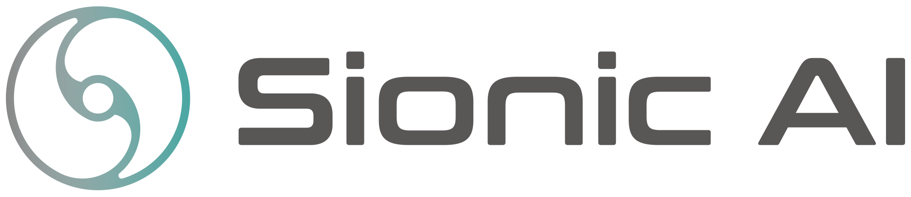

# Langcon2024

```yaml
cleanUrl: "/Langcon2024"
floatFirstTOC: right
title: "생성 모델 튜닝 어디까지 왔나"
```

주제 : 생성 모델 튜닝 어디까지 왔나?

일시 : 2024년 3월 2일(토)


# 장소 : [더케이트윈타워 A 13F(@마이크로소프트)](https://naver.me/5MS2ifTp)

---

   광화문역 2번 출구에서 385m

.png)

# **후원**

마이크로 소프트

.svg.png)

사이오닉 에이아이



엠 로보


인프런


## [자주하는 질문](https://songys.github.io/2023Langcon/jekyll/update/2020/02/15/welcome-to-jekyll.html)

[발표 및 스탭 안내](Langcon2024/%EB%B0%9C%ED%91%9C%20%EB%B0%8F%20%EC%8A%A4%ED%83%AD%20%EC%95%88%EB%82%B4%2018c94b390fd2809a8a3cf51a22d19ff4.md)

[이전 대회](Langcon2024/%EC%9D%B4%EC%A0%84%20%EB%8C%80%ED%9A%8C%2018c94b390fd280ceb973dad953d1dd64.md)

[자주하는 질문](Langcon2024/%EC%9E%90%EC%A3%BC%ED%95%98%EB%8A%94%20%EC%A7%88%EB%AC%B8%2018c94b390fd280969255c345a5b7e885.md)